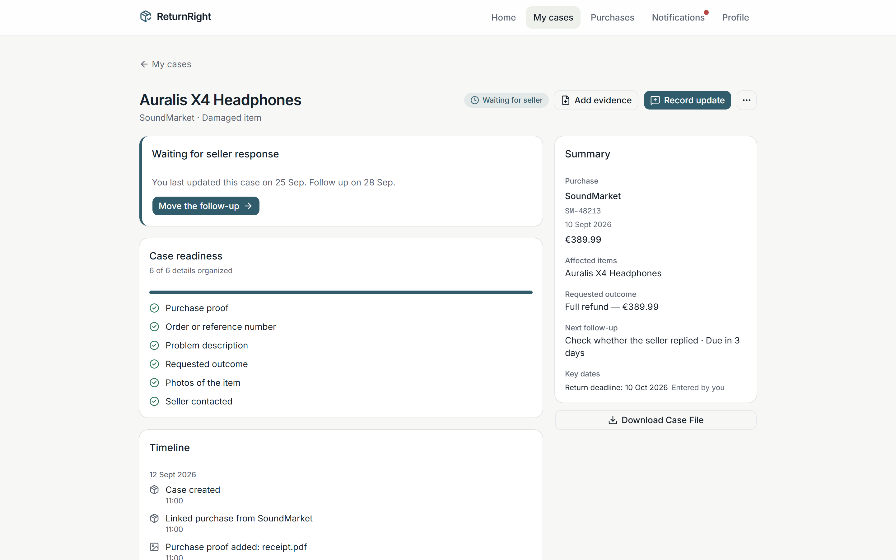
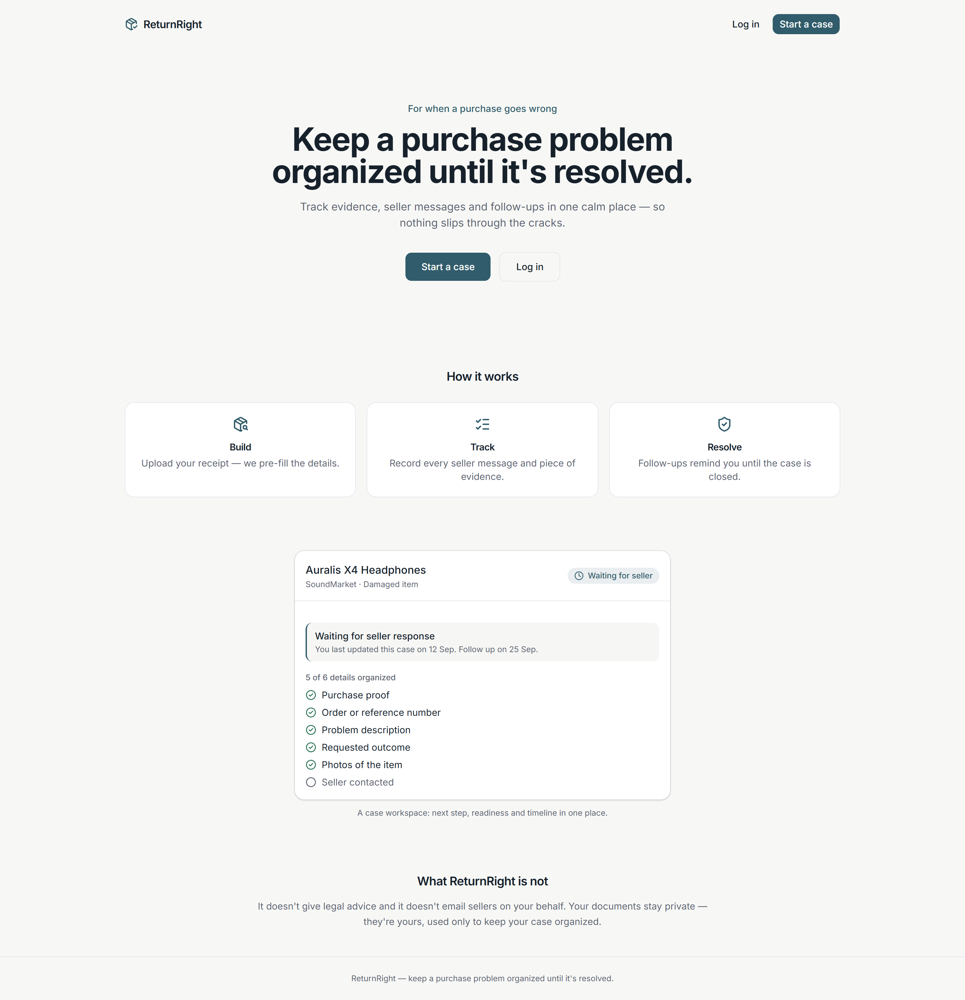
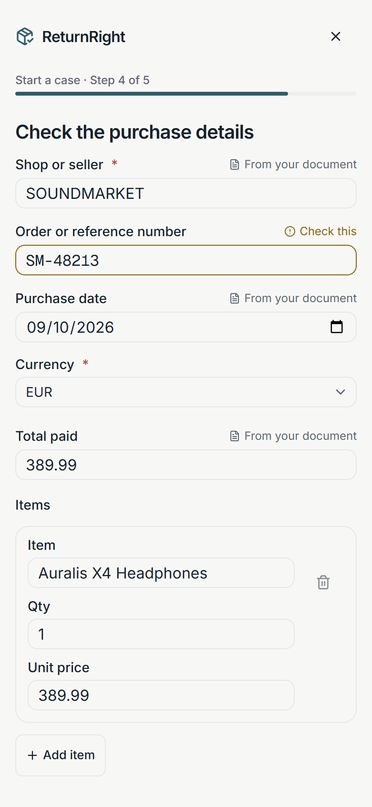
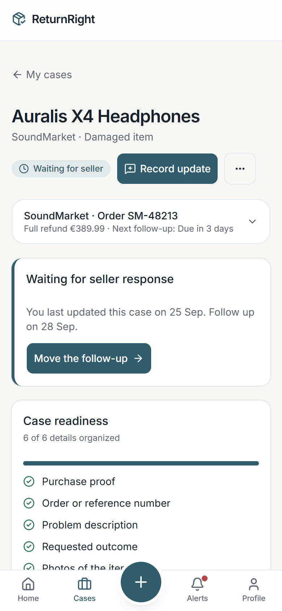
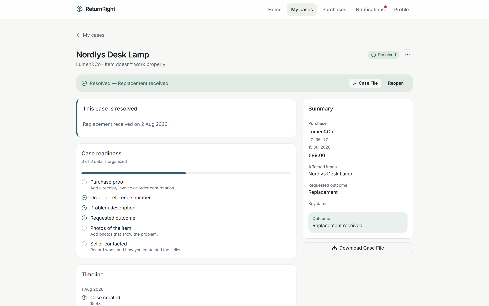
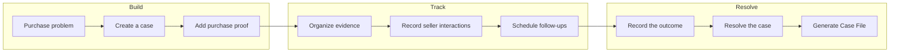
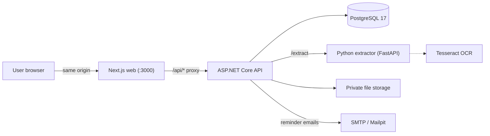

# ReturnRight

**A full-stack consumer platform for managing purchase problems from first complaint to final resolution.**

[](https://github.com/shah-nawaz-git/ReturnRight/actions/workflows/ci.yml)


When something you bought arrives damaged, never arrives, or the refund you were promised never shows up, ReturnRight gives you one structured workspace for the whole problem: the receipt, the photos, what the seller said, what you asked for, when to follow up, and how it ended.

The central object is the **issue case**, not the receipt. ReturnRight is not a receipt tracker, a warranty wallet, an expense manager, a chatbot or a legal-advice service.

> Runs locally with Docker Compose. There is no hosted demo.

## Product



*The case workspace. Left: the next obvious step and a readiness checklist. Right: purchase, affected items, requested outcome, next follow-up and the Case File download.*



<p align="center">
  
  &nbsp;&nbsp;
  
</p>

*Mobile (390 px). Left: the wizard after a receipt upload. Fields read from the document are tagged "From your document"; a low-confidence value is tagged "Check this" and highlighted. Right: the same workspace as above on a phone.*



*A resolved case: the final outcome is recorded separately from what was requested, and the Case File is still one click away.*

## The problem

A purchase problem produces information in a dozen places: an invoice in an email, damage photos on a phone, an order number in a confirmation, a tracking link, a seller's reply in a chat, a refund promise with a date nobody wrote down. Weeks later the user has to reconstruct the story from scratch. ReturnRight keeps that story in one place while it is happening.

## What ReturnRight does

| Pillar | What the user gets |
| --- | --- |
| **Build** | Start a case in a short guided flow: what went wrong, what you want the seller to do, and your receipt or order confirmation, read automatically where possible and always editable. |
| **Track** | Keep evidence, seller interactions, the requested outcome and follow-ups together. A plain-language timeline records what happened and when, and reminders make sure follow-ups are not forgotten. |
| **Resolve** | See which details are still missing and what the next obvious step is. Record how the case actually ended and export a **ReturnRight Case File** PDF that summarizes everything. |

## Core workflow



## Key features

- **Guided case creation.** A five-step wizard asks what happened (seven plain-English problem types), what the user wants (six requested outcomes), which purchase it concerns and which items are affected. The draft survives a page reload.
- **OCR-assisted purchase intake.** Upload a PDF, JPG or PNG receipt and a small Python service proposes merchant, date, order number, total and line items as *candidates* with a confidence score. The user confirms every value before anything is saved; low-confidence values are flagged "Check this". If extraction fails, the wizard falls back to manual entry and keeps the document as purchase proof.
- **Multi-item purchases.** A purchase has many items; a case can affect one, several or all of them.
- **Case Readiness.** A deterministic checklist ("5 of 6 details organized") showing whether the information needed to explain the problem clearly is in place. It adapts to the problem type (a refund problem asks for refund details, a damaged item asks for photos). It is an organizational completeness check, not a prediction of success and not a legal assessment.
- **Next Action.** A rule-based "next step" card derived from the case state: add proof, set the requested outcome, contact the seller, a follow-up is overdue, the promised refund date has passed, schedule a follow-up, or "you're up to date". No AI, no legal guidance; some suggestions can be dismissed.
- **Evidence management.** Private uploads of photos, screenshots, receipts and confirmations by drag-and-drop, file picker or phone camera, each typed (damage photo, seller communication, delivery tracking, refund confirmation, ...).
- **Seller interaction tracking.** Contact attempts, replies, information requests, return approvals, refund and replacement promises. Some interaction types move the case forward automatically: recording "Refund promised" sets the status to *Refund pending* with the expected date.
- **Follow-ups and reminders.** Each follow-up creates persisted email and in-app reminders. A background worker delivers them, retries failures after 5, 30 and 120 minutes, and shows a visible failed state instead of silently dropping them. Reminders are cancelled when the case is resolved.
- **Resolution lifecycle.** The requested outcome (full refund) is tracked separately from the final outcome (partial refund received, replacement received, seller rejected, abandoned). Resolved cases can be reopened.
- **ReturnRight Case File.** An on-demand PDF with summary, purchase, problem, timeline, seller interactions, evidence index and image appendix, final outcome, and a note that it does not certify legal entitlement to any outcome.
- **Privacy by design.** Every record belongs to one account; deleting the account removes every row and every stored file.

## What makes it different

ReturnRight is designed around what happens *after* a purchase goes wrong. Receipts and documents support the workflow, but the product is the resolution case: what went wrong, what the user wants, what evidence exists, what the seller said, what should happen next, and how the case eventually ended. A receipt or warranty tracker stops at "here is the proof"; ReturnRight starts there.

## Technical highlights

- **Three services, one origin.** The browser only ever talks to the Next.js app; `/api/*` is proxied server-side to the ASP.NET Core API, so authentication is a plain same-origin cookie with no CORS surface and no tokens in browser storage.
- **Feature-organized .NET 10 minimal API** (`Features/Auth`, `Cases`, `Intakes`, `Evidence`, `Interactions`, `FollowUps`, `Reminders`, `Exports`, ...) with EF Core migrations, ASP.NET Core Identity, an antiforgery middleware on every mutating route and RFC 7807 problem responses.
- **Relational model built for real orders**: `Purchase` → `PurchaseItem`, `IssueCase` → `CaseAffectedItem`, plus `Evidence`, `Interaction`, `FollowUp`, `Reminder`, `CaseTimelineEvent` and `InAppNotification`, all scoped to the owning user.
- **Two-phase document intake.** An upload creates a `TemporaryIntake`; the API calls the extractor and stores its candidates as `jsonb`; the user confirms; only then is a `Purchase` written. Expired intakes are swept by a background job.
- **Deterministic extraction service** in FastAPI: PyMuPDF for the PDF text layer, Tesseract OCR fallback for scans and photos, heuristics that return per-field confidence and the source lines. It never persists bytes and makes no external calls.
- **Business rules as small tested services**: Case Readiness, Next Action, interaction-driven status transitions and resolution rules are pure C# with unit tests.
- **Reminder pipeline** with a polling hosted worker, MailKit SMTP delivery, in-app notifications, bounded retries and per-reminder failure state.
- **Private file handling**: uploads validated by content signature, stored under generated keys on a private volume, streamed only through authenticated owner-scoped endpoints with `nosniff`, `no-store` and a sandboxing CSP.
- **PDF export** with QuestPDF; integration tests parse the generated PDF (PdfPig) and assert on its text.
- **Accessible, mobile-first UI**: React Aria for file drop and triggers, focus-managed dialogs, reduced-motion support, and axe-core checks in the E2E suite.
- **Docker Compose stack of five services**, built from scratch in CI and exercised end to end with Playwright on every push.

## Architecture



The **web** app owns rendering and the server-side API proxy and holds no state of its own. The **API** owns authentication, authorization, validation, every business rule, file storage, extraction orchestration, reminder delivery and PDF export. The **extractor** turns one document into structured candidates and forgets it. **PostgreSQL** stores all relational data (never file bytes); files live on a private volume behind an `IFileStorage` abstraction. **Mailpit** is the development SMTP sink; any SMTP server works through configuration.

Deeper detail: [docs/ARCHITECTURE.md](docs/ARCHITECTURE.md) (data flows, domain model, key decisions), [docs/SECURITY.md](docs/SECURITY.md) (threat model and controls), [docs/UX.md](docs/UX.md) (design principles, components, accessibility).

## Tech stack

| Layer | Technologies |
| --- | --- |
| Frontend | Next.js 16 (App Router), React 19, TypeScript (strict), Tailwind CSS 4, shadcn/ui on Base UI, React Aria Components, TanStack Query, React Hook Form + Zod, Motion |
| Backend | ASP.NET Core 10 minimal APIs, C#, Entity Framework Core 10, ASP.NET Core Identity, FluentValidation |
| Data | PostgreSQL 17 (Npgsql) |
| Extraction | Python 3.12, FastAPI, PyMuPDF, Tesseract via pytesseract, Pillow, Pydantic |
| Email | SMTP via MailKit; Mailpit in development |
| PDF | QuestPDF (generation), PdfPig (test assertions) |
| Testing | xUnit + Testcontainers, Vitest + Testing Library, Playwright + axe-core, pytest, Ruff |
| Infrastructure | Docker, Docker Compose, GitHub Actions, Gitleaks |

## Security and privacy

Security measures implemented include:

- Passwords hashed by ASP.NET Core Identity (PBKDF2, per-user salt); minimum length 10; five failed attempts trigger a five-minute lockout.
- Sessions in an `HttpOnly`, `SameSite=Lax` cookie, `Secure` by default (relaxed only for plain-HTTP local development). No JWTs in `localStorage`.
- CSRF protection on every state-changing `/api/*` request, including login and registration (`X-CSRF-TOKEN` header validated against a cookie).
- Server-side ownership checks on every resource; another user's resource returns **404**, never 403, so existence is not disclosed.
- Uploads validated by content signature (PDF, JPEG, PNG), declared type and extension consistency, and a 10 MB cap; filenames sanitized; stored under generated keys on a private volume; never served from a public URL.
- Downloads streamed through authenticated endpoints with `X-Content-Type-Options: nosniff`, `Cache-Control: private, no-store` and `Content-Security-Policy: sandbox`.
- Account deletion re-checks the password, then removes all rows and all stored files.
- Rate limiting (HTTP 429) on login/registration and on uploads, the latter per authenticated user. See the limitation below about client IPs behind the bundled proxy.
- Logs contain identifiers, statuses and exception types, never passwords, document contents or OCR text.
- Optional shared secret between the API and the extractor; the extractor is not exposed outside the Compose network.
- Gitleaks, `npm audit`, `pip-audit` and `dotnet list package --vulnerable` run in CI.

This is self-reviewed verification, not an external audit. Details, verification performed and known gaps: [docs/SECURITY.md](docs/SECURITY.md).

## Testing and quality

Every push to `main` runs five GitHub Actions jobs: `web`, `api`, `extractor`, `security`, and `e2e`, which builds the full Docker Compose stack from scratch and runs Playwright against it.

| Area | What runs | Behaviour covered |
| --- | --- | --- |
| Frontend | ESLint, `tsc`, Vitest component tests, production build | API client CSRF retry, wizard state and validation, file drop zone, confirm dialog, home page, next-step and readiness cards, status badges, date/money formatting |
| API unit (xUnit) | Pure rule services | Readiness per problem type, Next Action priority, interaction → status rules, resolve/reopen rules, reminder retry policy, upload validator, storage path safety, email templates |
| API integration (xUnit + Testcontainers PostgreSQL) | Full HTTP stack against a real database | Register/login/logout, CSRF, rate limits, cross-user authorization on every resource type, intake → purchase, evidence and document downloads, follow-ups, reminder processing, notifications, account deletion, Case File PDF text |
| Extractor (pytest) | Heuristics, PDF, image/OCR pipeline, validation | Clean invoices, scanned receipts through real Tesseract, low-quality images, disguised and malformed files, page and pixel limits, no persistence |
| End-to-end (Playwright, desktop 1440×900 and Pixel 7 390×844) | Real browser against the running stack | Register → wizard with a real invoice upload → evidence → readiness change → seller contact → follow-up → refund promised → resolve → Case File download; extraction failure → manual fallback; mobile flow including camera/photo picker; reminder email found through Mailpit's API; cross-user, anonymous, CSRF, disguised-file, oversize and stored-XSS checks; axe accessibility scans |
| Security | Gitleaks (full history), `npm audit`, `pip-audit`, `dotnet list package --vulnerable` | No committed secrets, no known high-severity dependency vulnerabilities |

At the time of writing, the latest CI run on `main` reports 81 API unit, 84 API integration, 51 extractor and 40 frontend component tests passing, and 25 Playwright runs passing across the two browser projects (19 scenarios; project-specific ones skip on the other project). Exact numbers live in the [Actions](https://github.com/shah-nawaz-git/ReturnRight/actions/workflows/ci.yml) log.

<details>
<summary>Run the tests locally</summary>

```bash
# API: unit + integration (integration uses Testcontainers; set RETURNRIGHT_TEST_CONNECTION
# to a PostgreSQL superuser connection string when Docker is not available)
cd apps/api && dotnet test

# extractor
cd services/extractor && ruff check . && python -m pytest

# web: lint, types, component tests, production build
cd apps/web && npm run lint && npm run typecheck && npm test && npm run build

# web: end-to-end against a running stack (PW_CHANNEL=chrome uses the system browser)
cd apps/web && PW_BASE_URL=http://localhost:3000 MAILPIT_URL=http://localhost:8025 npx playwright test
```

</details>

## Run locally

Prerequisites: Docker with Compose v2.

```bash
git clone https://github.com/shah-nawaz-git/ReturnRight.git
cd ReturnRight
cp .env.example .env        # optional: set DEMO_PASSWORD to get a seeded demo account
docker compose up --build
```

| Service | URL |
| --- | --- |
| Web app | http://localhost:3000 |
| Mailpit inbox (reminder emails) | http://localhost:8025 |

The API applies EF Core migrations on startup, so an empty database is fine. The API and extractor are internal to the Compose network. If `DEMO_PASSWORD` is set, `demo@returnright.local` is created with two example cases (one waiting for the seller, one resolved), which is what the screenshots show.

<details>
<summary>Run without Docker</summary>

You need PostgreSQL 17, Mailpit, Tesseract (`eng`), Node 24, the .NET 10 SDK and Python 3.12.

```bash
# database (once)
psql -U postgres -c "create role returnright login createdb password 'returnright'" \
                 -c "create database returnright owner returnright"

# API — http://localhost:5080 (Development applies migrations; seeds when Seed__DemoPassword is set)
cd apps/api/src/ReturnRight.Api && Seed__DemoPassword=DemoPass12345 dotnet run

# extractor — http://localhost:8000
cd services/extractor && python -m venv .venv && .venv/Scripts/pip install -r requirements.txt -r requirements-dev.txt
TESSERACT_CMD=/path/to/tesseract .venv/Scripts/uvicorn app.main:app --port 8000

# web — http://localhost:3000
cd apps/web && npm ci && npm run dev
```

On Windows, `scripts/dev-stack.ps1` starts the three application processes once PostgreSQL and Mailpit are running.

</details>

## Project structure

```
apps/
  api/          ASP.NET Core API (src/ReturnRight.Api; tests/ReturnRight.UnitTests, tests/ReturnRight.IntegrationTests)
  web/          Next.js app (src/app routes, src/components; e2e/ Playwright specs)
services/
  extractor/    FastAPI document extraction service (app/; tests/ with fixtures)
docs/           ARCHITECTURE.md, SECURITY.md, UX.md, screenshots/
scripts/        Windows helpers for running the stack without Docker
docker-compose.yml, .env.example, .github/workflows/ci.yml
```

## Known limitations

- **OCR is best effort.** Heuristics work well on clean invoices and readable photos; skewed or low-contrast scans may yield partial or no candidates. The user confirms every value.
- **No legal advice.** ReturnRight never states that the user is entitled to an outcome and does not compute statutory guarantee periods. Return deadlines and warranty dates are entered and confirmed by the user.
- **No integrations.** No inbox scanning, retailer or carrier APIs, payments or chargebacks.
- **Reminder channels** are email and in-app only.
- **Single-node storage.** Files live on a local volume behind `IFileStorage`; object storage is a future swap, not a current option.
- **Rate limiting is per API instance and IP-naive behind the bundled proxy.** Forwarded client IPs are trusted only from loopback proxies, so in the Compose stack all users share the login/registration limit. Uploads are limited per user regardless.
- **No strict Content-Security-Policy** on the web app yet (Next.js inline scripts); other security headers are set. No MFA, email verification or password reset.
- **Docker Compose was validated in CI** (GitHub Actions), not on the Windows machine this was developed on, which had no Docker.

## Future direction

- Email forwarding/import of order confirmations.
- S3-compatible `IFileStorage` implementation.
- Push notifications as an additional reminder channel.
- Optional retailer integrations for order lookup.
- Better extraction for multi-page and multi-language documents.

## License

Personal portfolio project. QuestPDF is used under its Community license.
