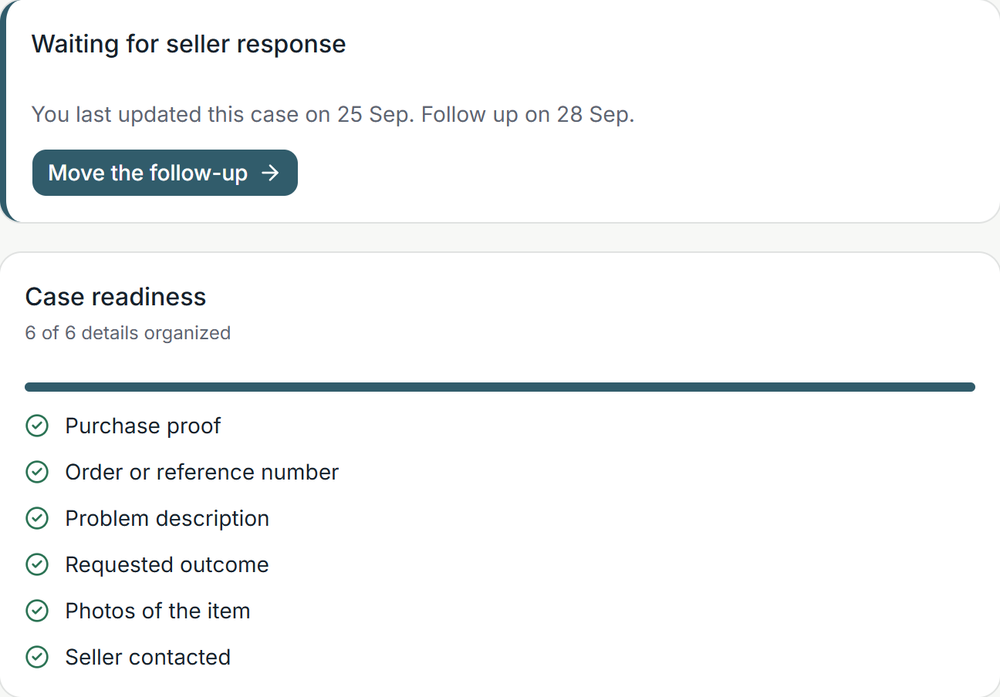

# ReturnRight

**Keep a purchase problem organized until it's resolved.**

When something you bought arrives damaged, never arrives, or the refund you were promised never shows up, the information you need ends up scattered: a receipt in one email, photos on your phone, the seller's reply in a chat, a date you meant to follow up on. ReturnRight gives you one structured workspace for that problem, from the first complaint to the final outcome.

It is not a receipt tracker, a warranty wallet or a legal-advice service. The central object is the **issue case**.


## What it does

ReturnRight has three pillars:

- **Build** — start a case in a short guided flow: what went wrong, what you want the seller to do, and your receipt or order confirmation (read automatically where possible, always editable).
- **Track** — keep evidence, seller interactions, requested outcomes and follow-ups together. A plain-language timeline records what happened and when.
- **Resolve** — see what is still missing, what the next obvious step is, and how the case ended. Export a **ReturnRight Case File** PDF that summarizes everything.


### Core features

| Feature | What it means for the user |
| --- | --- |
| Guided issue cases | Seven plain-English problem types (damaged, defective, wrong item, missing item, delivery, refund, other) and six requested outcomes, all handled by one small case engine. |
| OCR-assisted intake | Upload a PDF/JPG/PNG receipt; a small Python service extracts merchant, date, order number, total and items as *candidates* with confidence. Low-confidence values are flagged "Check this". If extraction fails, manual entry just works. |
| Multi-item purchases | A receipt can have many items; a case can affect one, several or all of them. |
| Case Readiness | A deterministic checklist ("5 of 6 details organized") that adapts modestly to the problem type. It never blocks the user and never predicts success. |
| Next Action | A rule-based "Next step" card: add proof, contact the seller, follow-up overdue, expected refund date passed, waiting for seller, and so on. No AI, no legal guidance. |
| Evidence | Private uploads with drag-and-drop, file picker and mobile camera capture; validated by file signature, never served from a public URL. |
| Seller interactions | Lightweight records of contact and replies. Some interaction types move the case status automatically (e.g. "Refund promised" → *Refund pending* with an expected date). |
| Follow-ups and reminders | Follow-ups create persisted email and in-app reminders processed by a background worker with retries (5 min, 30 min, 2 h) and a visible failure state. |
| Case File | On-demand PDF: summary, purchase, problem, timeline, interactions, evidence index, image appendix, final outcome. |
| Privacy by design | Cookie sessions, CSRF protection, object-level authorization on every request, account deletion that removes stored files. |

<p>
  
  
</p>



## Architecture

```
Browser ──► Next.js (web, :3000) ──/api/* rewrite──► ASP.NET Core API (:8080 / :5080)
                                                         │        │        │
                                                         │        │        └──► SMTP (Mailpit in dev)
                                                         │        └──► Private file storage (volume)
                                                         └──► PostgreSQL
                                                  API ──► FastAPI extractor (:8000, PyMuPDF + Tesseract)
```

- **apps/web** — Next.js 16, React 19, TypeScript strict, Tailwind v4, shadcn/ui, React Aria (file drop/trigger), TanStack Query, React Hook Form + Zod, Motion, Playwright, Vitest. The browser only ever talks to the Next.js origin; `/api/*` is proxied server-side to the API, so cookies are same-origin and there is no CORS.
- **apps/api** — .NET 10 minimal API organized by feature (`Features/Auth`, `Cases`, `Intakes`, `Evidence`, `Interactions`, `FollowUps`, `Reminders`, `Notifications`, `Exports`, ...), EF Core + Npgsql, ASP.NET Core Identity with cookie auth, antiforgery middleware, built-in rate limiting, hosted background workers for reminders and intake cleanup, QuestPDF for the Case File.
- **services/extractor** — deliberately small FastAPI service: PDF text via PyMuPDF, OCR fallback via Tesseract, deterministic heuristics. It never stores documents and never calls external AI.
- **PostgreSQL** for data, **Mailpit** as the development SMTP sink.

See [docs/ARCHITECTURE.md](docs/ARCHITECTURE.md) for diagrams and data flows, [docs/SECURITY.md](docs/SECURITY.md) for the threat model and controls, and [docs/UX.md](docs/UX.md) for design principles and tokens.

## Security and privacy decisions

- Email/password auth via ASP.NET Core Identity; sessions in an `HttpOnly`, `SameSite=Lax` cookie (`Secure` outside local HTTP). No JWTs in localStorage.
- Every state-changing request needs an antiforgery token (`GET /api/auth/csrf` → `X-CSRF-TOKEN` header).
- Every query is scoped to the authenticated owner; another user's resource returns **404**, never 403.
- Uploads are validated by magic bytes, size (10 MB) and extension consistency; stored under generated keys in a private volume; served only through authenticated endpoints with `nosniff`, `no-store` and a sandboxed CSP.
- Rate limits on login/registration (per IP) and uploads (per user).
- Logs contain identifiers and error types, never passwords, document contents or OCR text.
- Deleting an account removes all rows and the physical files.

## Local setup

### With Docker (recommended)

```bash
cp .env.example .env          # set DEMO_PASSWORD if you want a seeded demo account
docker compose up --build
```

Then open <http://localhost:3000>. Mailpit's inbox is at <http://localhost:8025>. The API applies EF Core migrations on startup, so an empty database is fine. If `DEMO_PASSWORD` is set, `demo@returnright.local` is created with two example cases.

### Without Docker

You need PostgreSQL 17, Mailpit, Tesseract (`eng`), Node 24, .NET 10 SDK and Python 3.12.

```bash
# database (once)
psql -U postgres -c "create role returnright login createdb password 'returnright'" \
                 -c "create database returnright owner returnright"

# API — http://localhost:5080 (Development applies migrations + seeds when Seed__DemoPassword is set)
cd apps/api/src/ReturnRight.Api && Seed__DemoPassword=DemoPass12345 dotnet run

# extractor — http://localhost:8000
cd services/extractor && python -m venv .venv && .venv/Scripts/pip install -r requirements.txt -r requirements-dev.txt
TESSERACT_CMD=/path/to/tesseract .venv/Scripts/uvicorn app.main:app --port 8000

# web — http://localhost:3000
cd apps/web && npm ci && npm run dev
```

On Windows, `scripts/dev-stack.ps1` starts the three application processes once PostgreSQL and Mailpit are running.

## Testing

```bash
# API: unit + integration (integration uses Testcontainers; set RETURNRIGHT_TEST_CONNECTION
# to a local PostgreSQL superuser connection string when Docker is not available)
cd apps/api && dotnet test

# extractor
cd services/extractor && .venv/Scripts/ruff check . && .venv/Scripts/python -m pytest -q

# web: lint, types, component tests, production build
cd apps/web && npm run lint && npm run typecheck && npm test && npm run build

# web: end-to-end against a running stack (PW_CHANNEL=chrome uses the system browser)
cd apps/web && PW_BASE_URL=http://localhost:3000 npx playwright test
```

E2E flows covered: full damaged-item resolution incl. Case File download, extraction failure → manual fallback, 390 px mobile flow, cross-user/CSRF/upload-abuse/XSS checks, and reminder delivery verified through Mailpit's API.

## Project structure

```
apps/
  api/            ASP.NET Core API (src/ReturnRight.Api, tests/Unit + Integration)
  web/            Next.js app (src/app routes, src/components, e2e Playwright specs)
services/
  extractor/      FastAPI document extraction service (app/, tests/fixtures)
docs/             ARCHITECTURE.md, SECURITY.md, UX.md, screenshots/
scripts/          Windows helper scripts for running the stack without Docker
docker-compose.yml, .env.example, .github/workflows/ci.yml
```

## Known limitations

- **OCR is best effort.** Heuristics work well on clean invoices and readable photos; skewed or low-contrast scans may produce partial or no candidates. The user always confirms.
- **No legal advice.** ReturnRight never states that the user is entitled to an outcome and does not compute statutory guarantee periods. Return deadlines and warranty dates are user-confirmed.
- **No integrations.** No email inbox scanning, retailer or carrier APIs, payments or chargebacks in V1.
- **Reminder channels** are email and in-app only.
- **Single-node storage.** Files live on a local volume behind an `IFileStorage` abstraction; S3-compatible storage is a future swap, not a current option.
- **No strict Content-Security-Policy** on the web app yet (Next.js inline scripts); other security headers are set.
- **Docker Compose was validated in CI** (GitHub Actions), not on the Windows machine this was developed on, which had no Docker.

## Future direction

- Email forwarding/import of order confirmations.
- S3-compatible `IFileStorage` implementation.
- Push notifications as an additional reminder channel.
- Optional retailer integrations for order lookup.
- Better extraction for multi-page and multi-language documents.

## License

Personal portfolio project. QuestPDF is used under its Community license.
