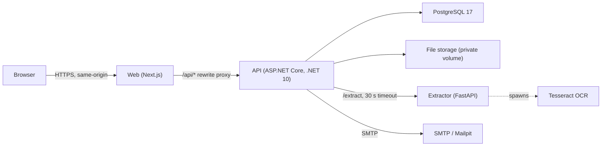
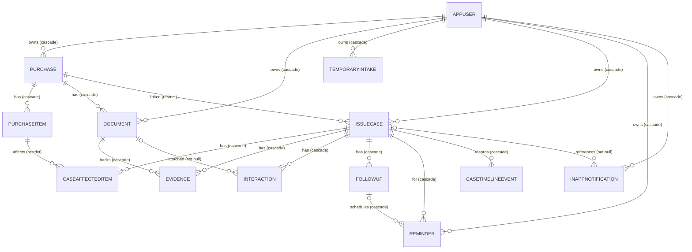
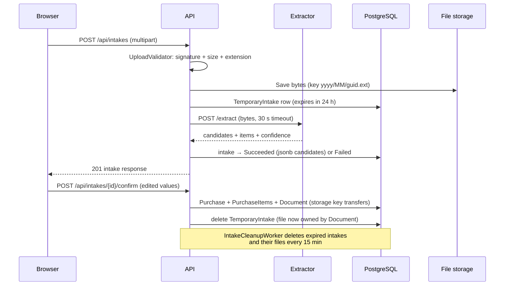
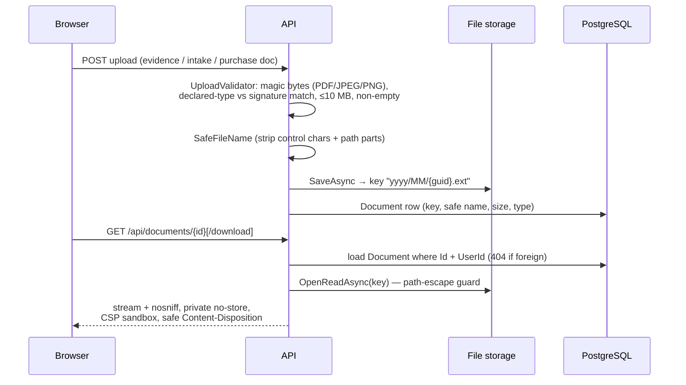
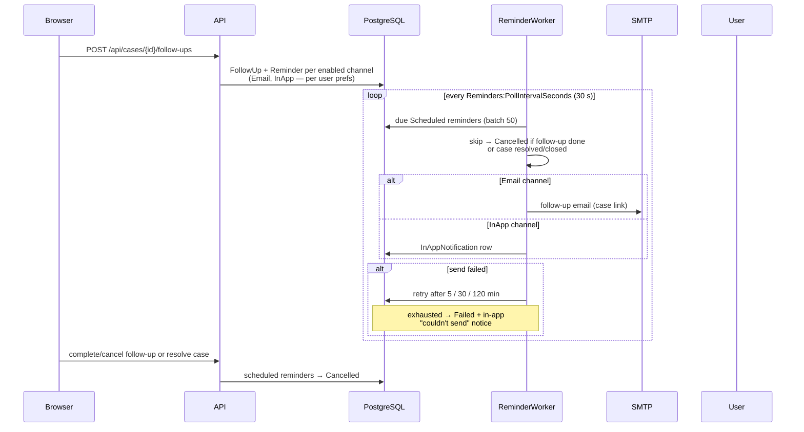
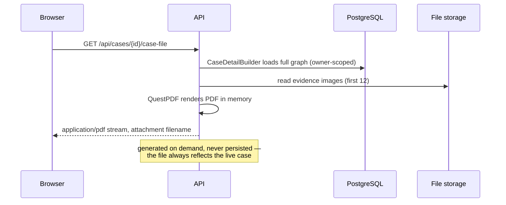

# Architecture

## Overview

ReturnRight is three deployables — a Next.js web app, an ASP.NET Core API and a
Python FastAPI extractor — plus PostgreSQL and an SMTP server (Mailpit in
development). The browser only ever talks to the Next.js origin: `/api/*`
requests are proxied by a server-side rewrite to the API, so auth cookies are
same-origin and there is no CORS surface. The API is the only component that
touches the database, the file volume, the extractor and SMTP. The extractor is
stateless: it receives file bytes, returns extracted candidate fields, and keeps
nothing.

## System diagram

## Service responsibilities

| Service | Does | Does not |
| --- | --- | --- |
| **web** (`apps/web`) | All UI: marketing pages, auth forms, case wizard, case workspace, purchases, notifications, profile. Server-side `/api/*` proxy. | No direct DB access, no file handling, no session logic — the API owns all state. |
| **api** (`apps/api`) | Authentication, authorization, validation, all business rules, file storage, extraction orchestration, reminder delivery, PDF export. | No rendering, no static assets. |
| **extractor** (`services/extractor`) | PDF text extraction (PyMuPDF), OCR fallback (Tesseract), deterministic field heuristics (merchant, date, order number, total, items) with per-field confidence. | No persistence of any kind, no database, no user data retention, no AI/LLM calls. |
| **postgres** | All relational data including extractor results as `jsonb` columns on `TemporaryIntake`. | Never stores file bytes. |
| **mailpit** | SMTP sink + web UI for development. | Not used in production; any SMTP server works via config. |

## Backend organization

`apps/api/src/ReturnRight.Api` is organized by feature, not by layer. Each
`Features/*` folder owns its endpoints, request/response contracts (records),
FluentValidation validators, and any feature-local services.

| Folder | Responsibility |
| --- | --- |
| `Auth` | register, login, logout, `/me`, CSRF token issue |
| `Profile` | preference toggles, password-gated account deletion |
| `Purchases` | purchase + items CRUD, provenance mapping |
| `Intakes` | temporary upload → extraction → confirm; `IntakeCleanupWorker` |
| `Documents` | authenticated file streaming (inline/download), delete |
| `Cases` | case CRUD, status transitions, `CaseDetailBuilder` graph loading, `CaseTimelineWriter`, `HomeEndpoints` (`GET /api/home`), `Readiness/` and `NextAction/` subfolders |
| `Evidence` | attach/detach evidence items on a case |
| `Interactions` | seller-contact records; `InteractionRules` maps types to status changes |
| `FollowUps` | follow-up scheduling, complete, move, cancel |
| `Reminders` | `ReminderScheduler`, `ReminderProcessor`, `ReminderWorker`, retry policy |
| `Notifications` | in-app notification list, mark-read, unread count |
| `Exports` | Case File PDF generation (`CaseFileDocument`, QuestPDF) |

Cross-cutting folders: `Domain` (entities + enums), `Persistence`
(`AppDbContext`, migrations, `DevSeeder`), `Storage` (`IFileStorage`,
`LocalFileStorage`, `UploadValidator`), `Email` (`SmtpEmailSender`,
templates), `Extraction` (`IExtractorClient`, `HttpExtractorClient`),
`Security` (`AuthSetup`, `AntiforgeryMiddleware`, `ValidationFilter`,
`RateLimitingSetup`, `ProblemResults`, `CurrentUser`).

Conventions:

- **Minimal API endpoint groups** — `Program.cs` maps groups
  (`/api/auth`, `/api/purchases`, `/api/cases`, …); each feature exposes a
  `MapXxxEndpoints` extension. All groups except `/api/auth` login/register
  call `RequireAuthorization()`.
- **FluentValidation via `ValidationFilter<T>`** — an endpoint filter that
  returns an RFC 7807 problem with an `errors` dictionary keyed by property.
- **RFC 7807 problem details everywhere** — `ProblemResults` produces
  consumer-friendly titles; unhandled exceptions become a generic
  `problem+json` via `UseExceptionHandler`, never a stack trace.
- **`TimeProvider` injection** — every time-dependent service takes
  `TimeProvider`; tests substitute a fake clock.
- **Enums stored as strings** — `ConfigureConventions` maps all domain enums
  to `string` columns; JSON uses `JsonStringEnumConverter`.
- **`FieldProvenance` owned type** — purchase and item fields carry an owned
  `FieldProvenance` (source, confidence, confirmed-by-user, source document)
  so extracted values stay distinguishable from user-entered ones.
- **Timeline writes go through `CaseTimelineWriter`** — endpoints never append
  `CaseTimelineEvent` rows directly.

## Domain model

Delete behavior is deliberate: deleting a user cascades to everything they own;
deleting a **purchase is restricted while a case references it** (the case is
the audit trail); deleting a document cascades to evidence rows but sets
`Interaction.DocumentId` to null (the note survives without the attachment);
deleting a case detaches notifications instead of erasing them.

## Key flows

### Purchase intake (upload → extracted purchase)

Extraction failure is a valid outcome: the intake is marked `Failed`, the file
is retained, and the confirm path still works — the user just enters fields
manually.

### File upload and download

### Reminders

### Case File export

## Readiness and Next Action

Both services are deterministic, pure functions over the loaded case graph —
no AI, no prediction.

**`CaseReadinessService`** produces a checklist that adapts to the problem
type: *purchase proof*, *order or reference number* (skipped for refund/other
problems), *problem description* (≥20 chars), *requested outcome* (refund
types require an amount), a problem-type-specific *supporting evidence* item
(photos for damaged/defective/wrong item, tracking for missing/delivery,
return/refund confirmation for refund problems), *seller contacted*, and
*promised or expected refund date* for refund problems. The result is
"N of M details organized" — it informs, it never blocks.

**`NextActionService`** returns priority-ordered candidates; the first whose
key isn't the dismissed one wins:

1. Resolved/closed → final-outcome summary (terminal)
2. Missing purchase proof → "Add your purchase proof"
3. Refund outcome without an amount → "Record what you're asking for"
4. No interactions yet → "Tell the seller about the problem"
5. Overdue follow-up → "Follow-up due"
6. `OutcomeExpectedBy` passed → "Check whether your refund arrived"
7. Waiting states with a scheduled follow-up → "Waiting for seller response"
   (last-update date comes from the latest timeline event)
8. First remaining incomplete readiness item (dismissible)
9. Seller contacted but nothing scheduled → "Schedule a follow-up" (dismissible)
10. Fallback → "You're up to date"

## Key decisions

- **Minimal APIs + feature folders over layered architecture.** The domain is
  small enough that controllers/services/repositories layers would add
  indirection without isolation; each feature folder keeps endpoint, contract
  and validation together, and shared rules (guards, timeline writing,
  label mapping) live in `Features/Cases`.
- **Cookies + antiforgery over JWT.** Server-managed `HttpOnly` sessions mean
  nothing sensitive is readable by JavaScript and logout actually revokes;
  the trade-off (CSRF surface) is handled by the double-submit middleware
  rather than avoided.
- **Same-origin proxy over CORS.** The browser sees one origin, so cookies use
  `SameSite=Lax` credibly and no CORS policy has to be maintained or mis-set.
- **PostgreSQL polling worker over Redis/queues.** Reminders are rows; the
  worker polls `Status = Scheduled AND NextAttemptAt <= now` (indexed). One
  less deployable, transactional state, and retries are just a column update.
  Adequate at consumer scale; a queue is the obvious upgrade path.
- **Synchronous extraction with a 30 s timeout over an async job queue.** The
  wizard wants candidates inline, so the API calls the extractor during the
  upload request. Trade-off: a slow OCR job holds the request open. The
  intake row keeps the result so a retry is free, and failure degrades to
  manual entry rather than blocking the user.
- **QuestPDF (Community license)** for the Case File — fluent layout, no
  external rendering service, streams to bytes. Runs in the API process; the
  PDF is generated per request and never stored.
- **Testcontainers with `RETURNRIGHT_TEST_CONNECTION` fallback.**
  Integration tests spin up PostgreSQL in Docker by default; when Docker is
  unavailable they use a developer-supplied connection string and create a
  per-run database.
- **React Aria for file interactions on top of shadcn/base-ui.** `DropZone`
  and `FileTrigger` (incl. mobile camera capture) come from
  `react-aria-components`. Gotcha: `FileTrigger` injects press behavior via a
  responder, so the child must be a RAC `Button` styled with
  `buttonVariants`, not the shadcn `Button` — otherwise clicks never reach
  the hidden input.
- **`output: standalone` + build-time `API_INTERNAL_URL`.** The web image is a
  standalone Node server. Because `next.config.ts` rewrites are resolved at
  build time, the Docker build bakes `API_INTERNAL_URL` (default
  `http://api:8080`) via a build arg — it cannot be changed at container
  runtime.

## Configuration

The API reads standard .NET configuration; every key below maps to an
environment variable with the `__` separator (e.g. `Storage__MaxUploadBytes`).

| Key | Default | Purpose |
| --- | --- | --- |
| `ConnectionStrings:Default` | local postgres | Npgsql connection string (`DATABASE_URL` in `.env.example`) |
| `Storage:RootPath` | `../../../storage` | upload root (`FILE_STORAGE_PATH`) |
| `Storage:MaxUploadBytes` | `10485760` | 10 MB upload cap (`STORAGE_MAX_UPLOAD_BYTES`) |
| `Extractor:BaseUrl` | `http://localhost:8000` | extractor URL (`EXTRACTOR_URL`) |
| `Extractor:TimeoutSeconds` | `30` | extraction call timeout |
| `Extractor:SharedSecret` | empty | optional `X-Extractor-Key` gate (`EXTRACTOR_SHARED_SECRET`) |
| `Auth:RequireSecureCookie` | `true` | `Secure` flag on `rr.auth`/`rr.csrf` (`AUTH_REQUIRE_SECURE_COOKIE`) |
| `RateLimiting:Enabled` / `:AuthPermitLimit` / `:UploadsPermitLimit` | `true` / `10` / `20` | per-IP auth limit, per-user upload limit, per minute |
| `Intakes:CleanupIntervalMinutes` | `15` | expired-intake sweep cadence (`INTAKE_CLEANUP_INTERVAL_MINUTES`) |
| `Smtp:Host` / `:Port` / `:From` / `:Username` / `:Password` / `:UseStartTls` | localhost:1025 | reminder email delivery (`SMTP_*`) |
| `App:BaseUrl` | `http://localhost:3000` | links in emails (`APP_BASE_URL`) |
| `Reminders:PollIntervalSeconds` | `30` | worker poll cadence (`REMINDERS_POLL_INTERVAL_SECONDS`) |
| `Reminders:RetryDelaysMinutes` | `[5, 30, 120]` | send-retry back-off (`REMINDERS_RETRY_DELAY_1..3`) |
| `Seed:Enabled` / `Seed:DemoPassword` | `true` / empty | demo seeding; no password → no seed (`DEMO_PASSWORD`, `SEED_DEMO_DATA`) |
| `Database:MigrateOnStartup` | `false` | apply EF migrations on boot (compose sets true) |
| `API_INTERNAL_URL` | `http://localhost:5080` | **web build-time** rewrite target (Docker build arg) |

Extractor settings (`services/extractor/app/config.py`, env names lowercase):
`tesseract_cmd`, `max_file_bytes` (10 MB), `max_ocr_pages` (5),
`ocr_timeout_seconds` (20), `min_text_chars_per_page` (40), `ocr_dpi` (200),
`extractor_shared_secret`.
